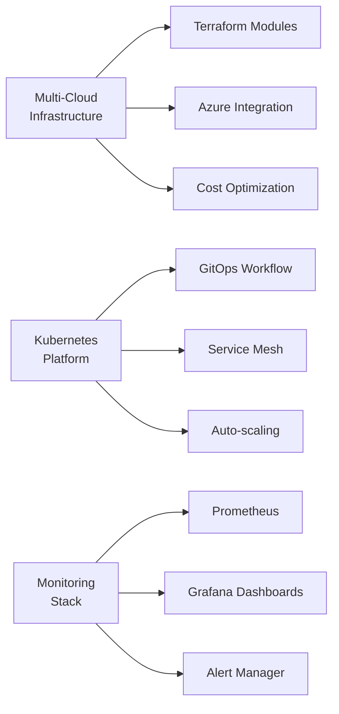

# नमस्ते 🙏, I'm TechMademi!

<div align="center">
  
  

  

  
  
  

</div>

---

## 👨‍💻 About Me


```yaml
name: Deepak Sharma
Contact: +91-9418174240
role: DevOps & Cloud Infrastructure Engineer
company: Netweb Technologies India Ltd.
location: Faridabad, India
motto: "Code once, scale everywhere"
status: Always learning something new! 📚
```

- 💼 **Currently Working:** DevOps Engineer at **Netweb Technologies**
- 📍 **Based in:** Faridabad, Haryana, India 🇮🇳
- 🧰 **Daily Tools:** `Terraform` • `Azure` • `Kubernetes` • `OpenStack` • `Docker`
- 💡 **Passionate About:** Infrastructure as Code, Cloud Automation, Solving Real-world Problems
- 💬 **Ask Me About:** Azure Pipelines, Linux Administration, OpenStack Cloud, CI/CD
- 🎯 **Current Focus:** Advanced Kubernetes, Multi-cloud Strategies, GitOps
- 🌱 **Learning:** Advanced Azure Services, Helm Charts, Service Mesh Technologies
- ⚡ **Fun Fact:** I can automate your coffee machine deployment with Terraform! ☕

---
# Blog posts
<!-- BLOG-POST-LIST:START -->
- [Terraform Module Example – Resource Group Creation on Azure](https://dev.to/techmademi/terraform-module-example-resource-group-creation-on-azure-281)
<!-- BLOG-POST-LIST:END -->
---
## 🛠️ Tech Arsenal

<div align="center">

### **☁️ Cloud Platforms**


### **🏗️ Infrastructure as Code**


### **🐳 Containerization & Orchestration**


### **🔧 DevOps & CI/CD**


### **💻 Operating Systems & Tools**


### **📊 Monitoring & Logging**


</div>

---

## 📊 GitHub Analytics

<div align="center">


</div>

<div align="center">
  


</div>

---

## 🏆 GitHub Achievements

<div align="center">


</div>

---

## 📈 Contribution Graph

<div align="center">


</div>

---

## 💼 Professional Experience

<details>
<summary><b>🏢 Current Role - DevOps Engineer @ Netweb Technologies</b></summary>

### Key Responsibilities:
- 🚀 **Infrastructure Automation:** Design and implement Infrastructure as Code using Terraform
- ☁️ **Cloud Management:** Manage Azure and OpenStack cloud infrastructure
- 🐳 **Container Orchestration:** Deploy and manage Kubernetes clusters
- 🔄 **CI/CD Pipelines:** Build and maintain Azure DevOps pipelines
- 📊 **Monitoring:** Implement comprehensive monitoring and alerting solutions
- 🛡️ **Security:** Ensure infrastructure security and compliance

### Recent Achievements:
- ✅ Reduced deployment time by 75% through automation
- ✅ Implemented cost optimization strategies saving 40% on cloud resources
- ✅ Achieved 99.9% uptime for critical applications
- ✅ Led migration of 50+ applications to Kubernetes

</details>

---

## 🎯 Current Projects



---

## 📚 Learning Path

<div align="center">

| **Currently Learning** | **Next in Queue** | **Future Goals** |
|:----------------------:|:-----------------:|:---------------:|
| 🎓 Advanced Kubernetes | 🚀 Service Mesh (Istio) | ☁️ Multi-Cloud Architecture |
| 🔧 GitOps with ArgoCD | 📊 Advanced Monitoring | 🤖 AI/ML in DevOps |
| 🛡️ Security Best Practices | 🏗️ Infrastructure Patterns | 🌐 Edge Computing |

</div>

---

## 🌟 Featured Repositories

<div align="center">

[](https://github.com/techmademi/terraform-azure-modules](https://github-readme-stats.vercel.app/api/pin/?username=techmademi&repo=3_tier_todoapp_terraform_infra_code&theme=tokyonight&hide_border=true)](https://github.com/techmademi/terraform-azure-modules))
<!-- [](https://github.com/techmademi/k8s-manifests) -->

</div>

---

## 📫 Connect With Me

<div align="center">

[](https://linkedin.com/in/techmademi)
[](mailto:techmademi@gmail.com)
[](https://github.com/techmademi)
[](https://twitter.com/techmademi)
[](https://youtube.com/c/mademitech)

</div>

---

## 💭 Quote of the Day

<div align="center">


</div>

---

## 🎯 Fun Fact

<div align="center">

```bash
#!/bin/bash
# My life philosophy in code

while [ ! $success ]; do
    try_again
    learn_something_new
    automate_everything
    share_knowledge
done

echo "Success is not a destination, it's a journey! 🚀"
```

</div>

---

## 📊 Weekly Development Breakdown

<!--START_SECTION:waka-->
```text
Terraform   8 hrs 45 mins   ████████████░░░░░░░░░░░░░   35.2%
YAML        6 hrs 12 mins   ██████████░░░░░░░░░░░░░░░   25.1%
Bash        4 hrs 30 mins   ███████░░░░░░░░░░░░░░░░░░   18.3%
Python      3 hrs 15 mins   █████░░░░░░░░░░░░░░░░░░░░   13.2%
Markdown    2 hrs 0 mins    ███░░░░░░░░░░░░░░░░░░░░░░   8.2%
```
<!--END_SECTION:waka-->

---

<div align="center">

### 🚀 "Infrastructure is not just about servers, it's about enabling dreams to scale!"


**Made with ❤️ and lots of ☕ by Deepak**

### 🌐 Let's Connect


</div>
